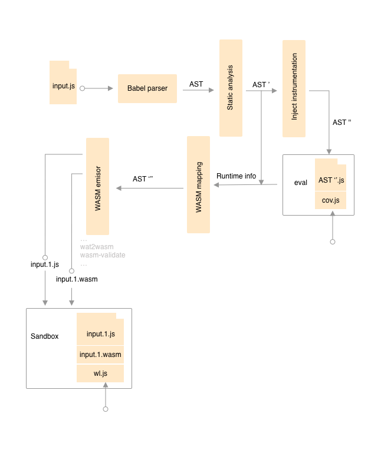
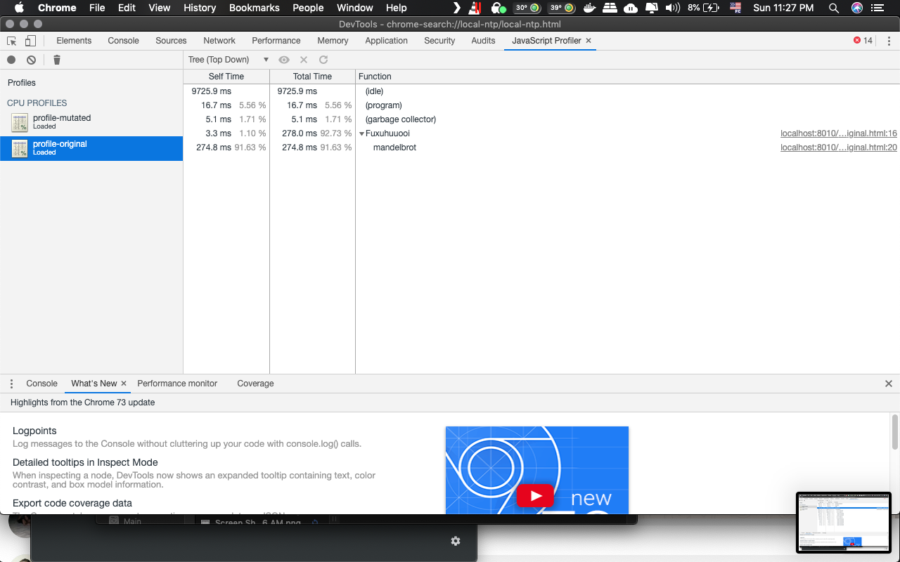

# JS to WASM diversification machine (Naenie proof of concept)

Naenie (*Many* in high valyrian words) tries to generate valid code mutations for JavaScript code using calls between WASM and JS as the mutation operator. This tool is a proof of concept yet, and it is growing right now.




It is possible to obtain an abstract syntax tree (AST) from a JavaScript input file. Babel parser brings an AST structure base on <a href="https://github.com/babel/babel/blob/master/packages/babel-parser/ast/spec.md" target="_blank">spec</a>. Basically, this tool (Naenie) extends those nodes with extra information. 

First, we analyze the static information from the JavaScript code like literal numbers, strings, booleans, etc. After that, we evaluate an instrumented version of the input code with some provided script to explore the runtime of the target. Later, the subtrees that can be translated to a Web Assembly Text (**WAT**) function are detected. The final step is to generate Web assembly binary code (**WASM**) and validate it.

The final output is a JavaScript file with its WASM complement.

Also, we implement a "sandbox" wrapper to test the generated code in a **Browser** or **NodeJS** with some workload using the both implementations: the original one and the mutated one.

Basically, we have three inputs for the tool:
1. The file to be mutated
2. The coverage script to evaluate de input script finding the maximum coverage
3. The workload script to evaluate the mutation against the original one.

And two outputs:
1. The mutated javascript code who calls WASM code to complement it
2. The complement WASM code


## Target subtrees

The objective of this tool is to find subtrees in the script AST and then substitute them for a equivalent call to WASM code. Due to JavaScript dynamic behavior, we are focusing to arithmetic expression up to date.


The image above shows a tree piece with the translatable subtrees drawn as red circles.

## Parametrization

We defined three principal parameters: min-size (min subtree size to replace), max-size (max subtree size to replace) and probability-threshold ( [0, 1] probability to translate the subtree ).

The preliminary analysis of the tools testing shows a overhead invocating WASM functions.

## Why is coverage script needed?

The main reason is to ensure the arithmetic subtree returns numeric values indeed (boolean values are mapped as int32 values, 0 and 1), watching for "large" integers and floats in runtime evaluation to create a correct mapping between them and the WASM numeric types.

If one operator in the arithmetic subtree (always binary subtree) cannot be accessed from the WASM context then this subtree is passed to the translated subtree as a function argument, for example:

```js
var a  = 1 + a[0]
```

Is translated to 

```js
var a = ww.Wrapper(a[0])
```

```
(function $Wrapper (param i32) (return i32)

    i32.const 1
    get_local 0
    i32.add
)
```

*We need to care about boolean operations shortcut too*

*Javascript does not support int64 function signature for WASM up to date https://github.com/dcodeIO/webassembly/issues/26*

# How to use it?

You can use two options to run the mutator:
1. Using ts-node: ```npm run ts src/main.dev.ts <target> <coverage> <workload>```
2. Compile the complete code to a ES6 JavaScript library ```npm run compile``` and then execute the compiled code ```node dist/naenie.js```

**Help output**

```
-v                          output the version number
-t --target <target>        Target script
-c --coverage <coverage>    Coverage script
-w --workload <workload>    Workload script
-m --minumum <minimum>      Minimum tree size to translate
-M --maximum <maximum>      Maximum tree size to translate
-u --threshold <threshold>  Probability to translate subtree
-s --sandbox <sandbox>      Sandbox wrapper: 'node' or 'browser'
-h, --help                  output usage information
```

**We use the <a target="_blank" href="https://github.com/WebAssembly/wabt">official tool set</a> from WebAssembly to compile and validate our code generation**

<!--

### Translation

- TODO

### Sandbox
- Node sandbox
- Browser sandbox

## Output

- Output structure

## Profiling

- Browser
  - Launch local server on output directory
  - Chrome basic
  - Firefox basic
  
- Node with perf in linux

-->

## Results

We provide a minimal tool to mutate JavaScript code to an hybrid between JS and WASM languages.


## Testing

Run ```python tests/run_all.py``` to execute the complete pipeline to mutate and profile target test scripts.

### Automated testing with Chrome

We open and profile the both, mutated and original codes, with the **workload script**. This process is done in an automated way using the 'chrome-remote-interface' and the 'chrome-launcher' node packages. The profiling output file protocol is showed below:

```ts
{
    nodes: {
        id: number,
        callFrame: {
            "functionName": string,
            scriptId: string,
            url: string,
            lineNumber: number,
            columnNumber: number
        },
        hitCount: number,
        children: number[],
        positionTicks?: {
            line: number,
            ticks: number
        }[]
    }[],

    startTime: number,
    endTime: number,
    samples: number[],
    timeDeltas: number[]
}
```
From **https://chromedevtools.github.io/devtools-protocol/tot/Profiler/#type-Profile**


## Mandelbrot call graph example

Mutated call graph


Original call graph



<!--
## Finding execution trace

1. Find target function
2. Start at the first index with the function id just after one lesser value
3. Stop at the next one value less than function id

-->

- Test subjects
  - quicksort (DONE)
  - zip  (DONE)
  - sudoku (In process)
  - md5 (In process)
  - rsa (In process)
  - rc4 (In process)
  - canny (In process)
  - lcs (In process)
  - laguerre (In process)
  - linreg (In process)
  - mandelbrot (DONE)
  - sha256 (DONE)
  

## Research and interesting things to look for

- Mutation output
  - Garbage collection calls as noise
- Mutated candidate performance and overhead
  - Execution time
  - Memory
  - CPU

# TODO
- Extend translatable subtrees coverage
- Extend testing to Firefox, Edge, Safari and NodeJS profiling
- Implement an oracle for the mutated code using a provided test suite
    ```
        mutation(script)(wl) == script(wl)
    ```