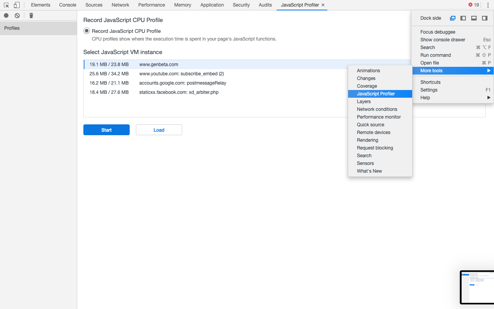

## FrameViewer

**Note** A JavaScript code running in chromium browser is single threaded, then, Javascript events, style and layout operations will block one another. 

The trace tool exports the data to a json file. Each process in the browser has a separate track view in the profiler view, this means, that each tab is a separate process too. The rectangular shapes are timeline tracks from left to right or TRACE_EVENT.

To study individual rectangles you can click on them. Showing:
 - Duration: 
 - ThreadDuration: (CPU time)
 - SelfTime: Time spent in the current slice, subtracting the time of all the children slices
 - ThreadSelfTime: CPU time spent int he current slice, subtracting the CPU time for all the children


Chromium browser profiler is focused in renderer processes, to detect bottlenecks in them, but also it tracks the JavaScript calls, because its main thread is a web app's UI thread...and that'' perfect for our purposes.


### Setting up a good trace run

1. Start with only the target tab and *about:tracing* open in fresh browser session.
2. Start tracing run in the about:tracing tab
3. Pause for a couple seconds to record empty space on the timeline (makes finding it later easier)
4. Switch back to the about:tracing tab and stop the recording

### Tips

From dev team: "We haven't instrument every single thing". But, we can add our own trace events.

Adding our own events is as simple as calling console.time() and console.timeEnd()

```js
function Foo(){
    console.time("Foo");

    var now = Date.now();
    while(Date.now() < now + 1000);

    console.timeEnd("Foo");
}
```


## JavaScript Profilers

This is another option for chrome javascript profiling. The tool export the recorded data to a json file too. 


1. ```js
    console.profile("Foo")
    // code to profile
    console.endProfile("Foo")
    ```

2. 

3. Open the tab with the script page.

### Automation

We can use the previous pipeline in a automated way

```bash
./chrome --no-sandbox --js-flags="--prof --log-timer-events" mail.google.com & sleep 10; kill $!
```

### Output file format 

- CPU profiling
    ```ts
    {
        nodes: {
            id: number,
            callFrame: {
                "functionName": string,
                scriptId: string,
                url: string,
                lineNumber: number,
                columnNumber: number
            },
            hitCount: number,
            children: number[],
            positionTicks?: {
                line: number,
                ticks: number
            }[]
        }[],

        startTime: number,
        endTime: number,
        samples: number[],
        timeDeltas: number[]
    }
    ```
- Trace summary:
    ```ts
    {
        [id:string]:{
            sum: number,
            count: number,
            min: number,
            max: number
        }
    }[]
    ```